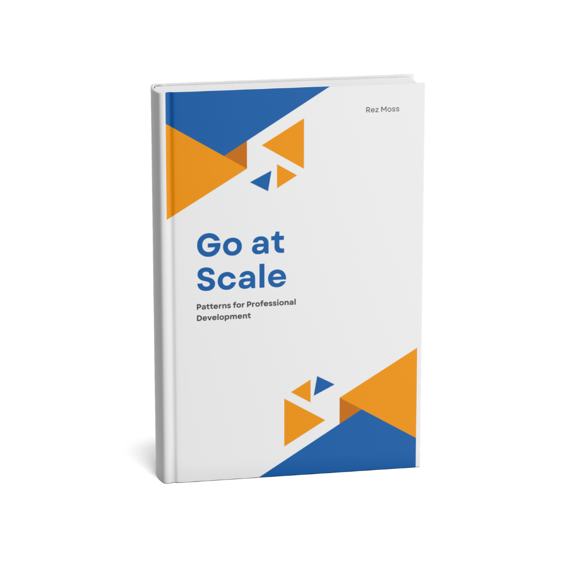

# Go at Scale : Patterns for Professional Development

[](https://www.amazon.com/author/rezmoss)  
<sup>_Click the cover to learn more or purchase the book._</sup>

Welcome to the **official companion repository** for _Go at Scale_. Here, you’ll find all the Go source files and practical examples referenced throughout the chapters and appendices. Each folder corresponds to a specific chapter or appendix, containing example code that demonstrates the advanced patterns, concurrency models, and clean coding techniques discussed in the book.

---

## Repository Overview

```
├── chapter1
│   ├── example_0.go
│   ├── example_1.go
│   ├── ...
├── chapter2
│   ├── example_9.go
│   ├── example_10.go
│   ├── ...
...
├── chapter14
│   ├── example_85.go
│   ├── example_86.go
│   ├── ...
├── appendixa
│   ├── example_90.go
│   ├── example_91.sh
│   ├── ...
├── appendixb
│   ├── example_102.go
│   ├── example_103.go
│   ├── ...
├── appendixc
│   ├── example_109.sh
│   ├── example_110.go
│   ├── ...
├── appendixf
│   ├── example_169.go
│   ├── example_170.go
│   ├── ...
└── ...
```

- **Chapters 1–14**: Contain the core examples illustrating advanced function design patterns, concurrency, performance, and more.  
- **Appendices (A, B, C, F, etc.)**: Contain additional material, edge cases, or specialized topics referenced in the book.


## Learn More or Buy the Book
For more details, deeper explanations, and additional tips on applying these patterns in real-world scenarios, [visit the author page](https://www.amazon.com/author/rezmoss).

I hope this repository helps you explore and master the advanced patterns covered in _Go at Scale: Patterns for Professional Development_. Happy coding!
